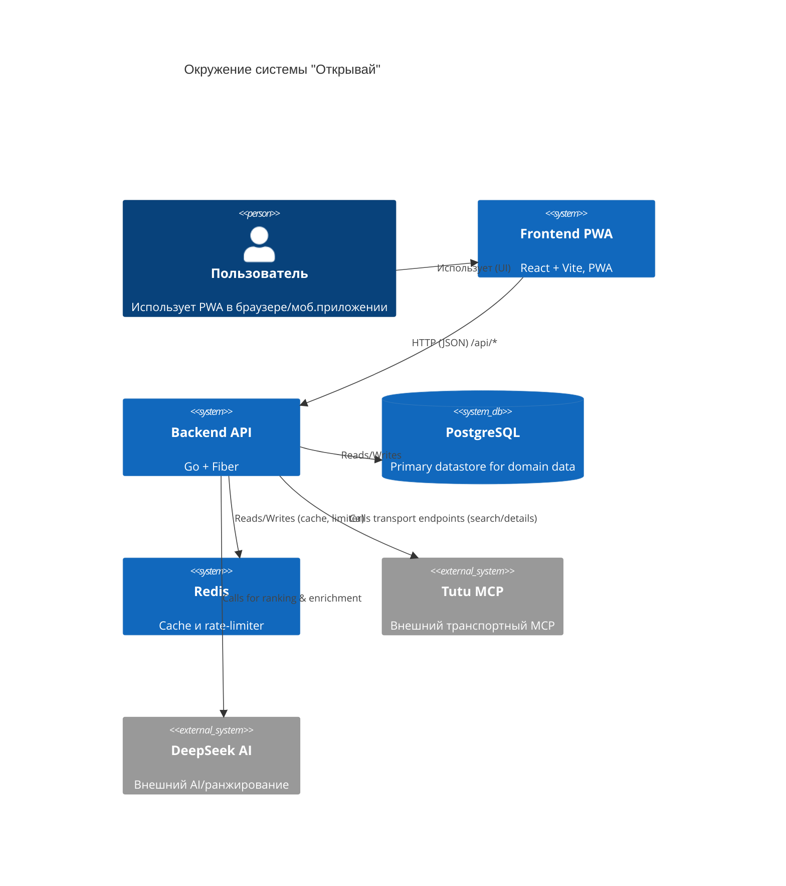
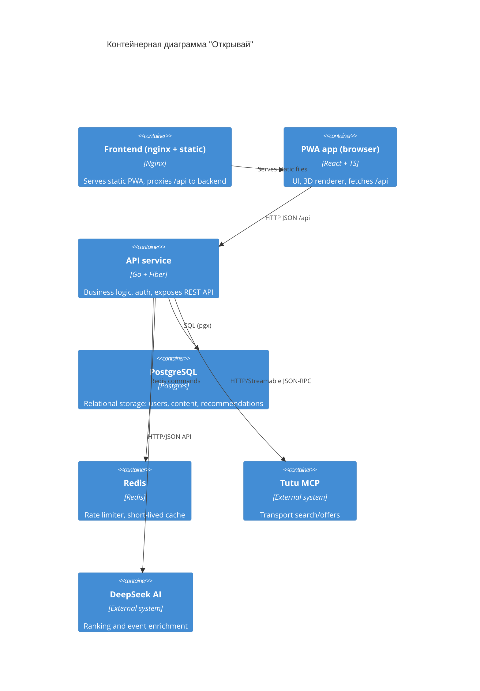
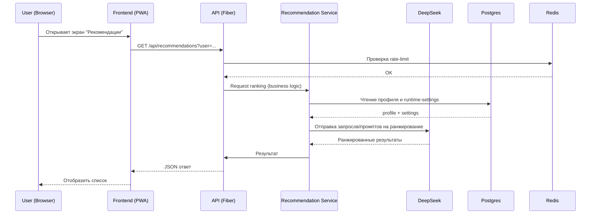

docker compose up --build
# "Открывай" — техническая документация

Коротко: репозиторий содержит backend на Go (Fiber), frontend PWA на React + Vite, набор миграций и фикстур для локального демо. Документация ниже покрывает запуск, архитектурные решения и ключевые файлы.

**Быстрый старт (Docker)**

- Скопировать пример окружения и запустить compose:

```bash
cp .env.example .env
docker compose up --build
```

- Откройте http://localhost:5173 (frontend). API доступен на http://localhost:8080.

**Локальная разработка (без Docker)**

```bash
# backend
cd backend && go run ./cmd/api

# frontend (Dev server)
cd frontend && npm install && npm run dev
```

**Обязательные переменные окружения**

- Основной шаблон: [.env.example](.env.example)
- Ключевые переменные: `DATABASE_URL`, `SESSION_SECRET` (min 32 chars), `REDIS_ADDR`, `DEEPSEEK_API_KEY` (если нужен AI), `DEMO_MODE` (true/false).

**Запуск миграций и наполнение демон-данными**

- Миграции выполняются автоматически при старте API (см. [backend/cmd/api/main.go](backend/cmd/api/main.go)).
- При `DEMO_MODE=true` сервис пополняет базу демон-данными (переменные `DEMO_*` в `.env`).

**Тесты и проверки**

```bash
# backend
cd backend && go test ./...

# frontend
cd frontend && npm run typecheck && npm run test && npm run build
```

# Архитектура проекта

## Краткий обзор

- Frontend: PWA на React + TypeScript, сборка через Vite, production-дистрибутив обслуживается nginx.
- Backend: Go, Fiber; слоистая архитектура: handlers -> services -> infra (storage, clients, transport).
- Хранилище: PostgreSQL (pgx/pgxpool) с миграциями и fixtures.
- Кеш/инфраструктура: Redis для rate-limiting, кешей и краткоживущих данных.
- Внешние интеграции: Tutu MCP (транспортные цены/оформление), DeepSeek (AI для ранжирования и обогащения).

Файлы и места ответственности:

- Точка входа backend: `backend/cmd/api/main.go` — инициализация ресурсов, миграции, демо-наполнение и запуск API.
- Конфигурация: `backend/resources/env.go` — централизованная загрузка переменных окружения и валидация.
- Ресурсы: `backend/resources/resources.go` — инициализация логгера, пула БД и клиента Redis.
- Роутинг и HTTP-сервис: `backend/internal/api/api.go`, `backend/internal/router/router.go`.
- Инфраструктура хранения: `backend/infra/storage/*` (репозитории, миграции, executor и т.д.).
- Клиенты внешних сервисов: `backend/infra/tutumcp`, `backend/infra/clients/deepseek`.
- Frontend entry: `frontend/src/main.tsx`, `frontend/src/App.tsx`.

---

## Подробное описание Backend

Архитектура backend спроектирована по принципам разделения ответственности, тестируемости и удобства развёртывания.

1) Инициализация и lifecycle

- Приложение стартует из `cmd/api/main.go`.
- Вызывается `resources.InitResources(ctx)`:
	- Загружает конфигурацию через `LoadEnv()`.
	- Создаёт `slog`-логгер с уровнем из конфигурации.
	- Инициализирует пул PostgreSQL (pgxpool) и проверяет соединение.
	- Создаёт Redis-клиент и проверяет ping.
- После успешной инициализации выполняются миграции (`infra/storage/postgres/migrations`) и, при включённом `DEMO_MODE`, заполняются фикстуры и демо-аккаунты.

2) Слои и контракты

- Handlers (HTTP): расположены в `internal/handlers/*`. Они выполняют валидацию входных данных, авторизацию (если требуется), превращают HTTP-запросы в вызовы сервисов и формируют HTTP-ответы.
- Services: бизнес-логика — `services/*`. Каждый сервис получает интерфейсы репозиториев (инъекции), что упрощает тестирование.
- Infra/storage: низкоуровневые реализации репозиториев, миграции, executor и transaction manager (`infra/storage/postgres/transaction_manager.go`).
- Клиенты внешних систем: инкапсулированы в отдельных пакетах (`tutumcp`, `deepseek`) и предоставляют упрощённые интерфейсы для сервисов.

3) Транзакции и консистентность

- Для операций, требующих атомарности, используется `transactionManager` из `infra/storage/postgres`.
- Репозитории принимают `context.Context` и `*pgxpool.Pool` или tx, чтобы не скрывать транзакционную семантику.

4) Rate limiting и защита

- Rate limiter реализован через Redis (`infra/ratelimit/limiter.go`). Он используется как middleware (ограничение попыток рекомендаций, логинов и API-запросов).
- Ограничения конфигурируются через переменные окружения: `REQUESTS_PER_MINUTE`, `LOGIN_ATTEMPTS_PER_HOUR` и т.д.

5) AI-ранжирование и event discovery

- DeepSeek-клиент (`infra/clients/deepseek`) предоставляет функции ранжирования рекомендаций, web-search для обнаружения событий и обогащения результатов (EventEnricher / EventDiscoverer).
- Новая логика discovery использует специализированный web-search транспорт DeepSeek, парсит строгий JSON-ответ и нормализует события перед сохранением в БД.
- System-промпты загружаются из репозитория `world` при старте и могут быть переопределены через переменные окружения, что даёт возможность корректировать поведение AI без релиза.
- Вызовы к DeepSeek выполняются с таймаутами, retry/backoff и строгой обработкой ошибок (см. `internal/errors/ai`).

6) Взаимодействие с Tutu MCP

- Tutu MCP клиент (`infra/tutumcp`) реализует Streamable HTTP/JSON-RPC и умеет пагинировать/получать детали и создавать ссылки на оформление.
- Клиент устойчив к сетевым сбоям: встроенные политики повторов с jitter и учётом заголовка `Retry-After`.

7) Observability и логирование

- Логи пишутся через `slog` в JSON-формате.
- Для production нужно подключить агрегатор логов и метрик (Prometheus/Jaeger по потребности). В коде есть hooks/places для добавления метрик (запросы к внешним клиентам, длительность, ошибки).


8) Миграции и содержимое БД

- Миграции находятся в `infra/storage/postgres/migrations`. Они содержат создание таблиц, индексирование и seed-скрипты для контента.
- В репозитории добавлены миграции, влияющие на discovery и промо-логику: `005_ai_event_discovery.sql` (поля для source_url, popularity_rank и таблица `event_discovery_runs`) и `006_city_promo_codes.sql` (поле `promo_percent` для `territories` и таблица `user_promo_codes`).
- Фикстуры с данными (города, promo vocabulary и контент) хранятся в `infra/storage/postgres/fixtures`.

---

## Подробное описание Frontend

Frontend — PWA, ориентирован на mobile-first UX, построен с учётом offline-first подхода для части функционала.

1) Структура приложения

- Entry: `src/main.tsx` и `src/App.tsx`.
- Разделение по фичам: `src/features/*` (world, recommendations, profile, trips, community и т.д.).
- Компоненты UI и вспомогательные хелперы в `src/components` и `src/shared`.

2) State и data fetching

- Глобальный state: `zustand` используется для клиентских состояний (ui, sheet, простые флаги).
- Асинхронные данные: `@tanstack/react-query` — кеширование, фоновое обновление, retry и stale handling.

3) 3D и heavy-assets

- `three` используется для рендера глобуса и 3D-атрибутики. Рендер вынесен в отдельные компоненты и лениво загружается, чтобы уменьшить initial bundle.
- Текстуры/шрифты лежат в `public/textures` и `public/fonts` и обслуживаются Nginx с aggressive caching (см. `frontend/nginx.conf`).

4) PWA и офлайн

- PWA реализуется через `vite-plugin-pwa`. Service Worker кеширует статические ресурсы и критичные API-ответы по необходимости.
- Политика обновления: `registerType: 'autoUpdate'` — SW обновляется автоматически.

5) Dev/Production parity

- Dev-сервер (Vite) проксирует `/api` на `http://localhost:8080` (см. `vite.config.ts`).
- Production: собранный `dist` разворачивается в nginx-контейнере; nginx конфиг обрабатывает `/api/` проксирование к backend-сервису и static-asset caching.

6) Безопасность на клиенте

- CSRF: front проксирует `/api` и использует куки/заголовки, backend проверяет origin/allowed hosts.
- Контроль CORS и trusted proxies настраивается через `ALLOWED_ORIGINS` и `TRUSTED_PROXIES`.

---

## Поток запроса (схема)

1) Пользователь открывает PWA в браузере (http://localhost:5173).
2) Frontend делает XHR/Fetch к `https://<public-base>/api/...` (локально проксируется на `http://localhost:8080`).
3) Fiber-handler валидирует запрос, выполняет аутентификацию/сессию (если нужна).
4) Handler вызывает сервисы (business logic), которые в свою очередь используют репозитории и внешние клиенты.
5) Для транзакционных операций используется `transactionManager`.
6) Репозитории обращаются к Postgres, часто с кешированием/лимитированием через Redis.
7) При необходимости сервис вызывает DeepSeek/TutuMCP и обогащает ответ.
8) Результат возвращается handler-ом и сериализуется в JSON в ответе.

---

## Диаграммы

Ниже два блока: C4 (контекст + контейнеры) и последовательность запроса. Диаграммы в формате mermaid.

### C4 — Context



### C4 — Containers



### Последовательность: запрос рекомендации



---

## Масштабирование и отказоустойчивость

- Backend: горизонтальное масштабирование сервисов API (stateless, state сохраняется в Postgres/Redis). Балансировщик перед API.
- Postgres: вертикальное масштабирование и репликация; read-replicas для heavy read workloads.
- Redis: кластеризация/репликация для отказоустойчивости.
- Tutu MCP и DeepSeek — внешние зависимости: применять таймауты, circuit-breaker и кешировать ответы.

## Безопасность и продакшен-практики

- `SESSION_SECRET` должен быть ≥ 32 символов; нельзя хранить значения по умолчанию в production.
- Отключать демо-функционал в production (`DEMO_MODE=false`).
- Настроить TLS для `PUBLIC_BASE_URL` и прокси/балансировщики.
- Контролировать `CHECKOUT_ALLOWED_HOSTS` и внимательно валидировать checkout ссылки от Tutu MCP.
- Перед деплоем убедиться, что все миграции применены (включая `005_ai_event_discovery.sql` и `006_city_promo_codes.sql`) и фикстуры загружены.
- Если вы используете event discovery/DeepSeek: установить `DEEPSEEK_API_KEY` и проверить доступность сервиса; при необходимости временно отключить discovery через `EVENT_DISCOVERY_ENABLED=false`.
- Проверить совместимость API с frontend (поля `promo_percent`, `popular_event`, `upcoming_events`), чтобы избежать рассинхронизации отображения маркеров и логики UI.
 - Контролировать `CHECKOUT_ALLOWED_HOSTS` и внимательно валидировать checkout ссылки от Tutu MCP.

